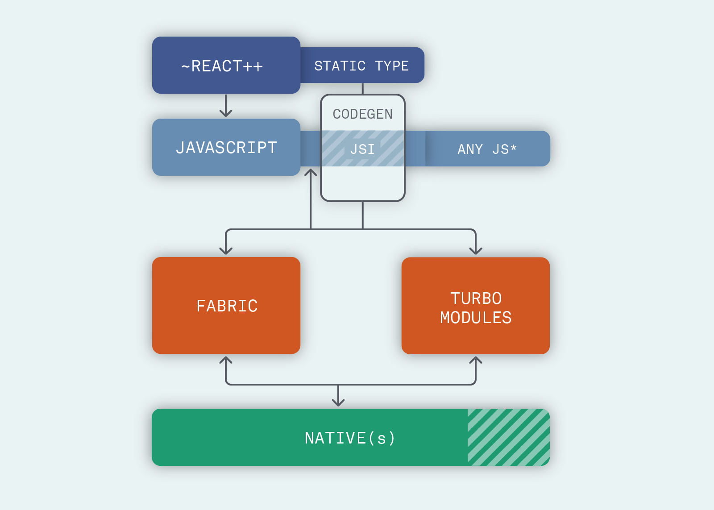

# Hello World com React Native 🌎

---

# Prazer, Humano 👽
### Dev Mobile Híbrido - Jetsons
###### Gosto de Cubo Mágico
###### Curto Jogos de Tabuleiro
###### Sei ler e escrever em morse

---

# O que é React Native?
#### "React Native combines the best parts of native development with React, a best-in-class JavaScript library for building user interfaces. Use a little—or a lot. You can use React Native today in your existing Android and iOS projects or you can create a whole new app from scratch."

---

## Como funciona? 🤔

---

## Código 🖥️
#### PokeDextra!

---

Referências
- [React Native Page](https://reactnative.dev/)
- [React Native Setup](https://reactnative.dev/docs/environment-setup)
- [Styles](https://reactnative.dev/docs/style)
- [Components](https://reactnative.dev/docs/components-and-apis)
- [Navigation](https://reactnavigation.org/docs/getting-started)
- [Navigation Stack](https://reactnavigation.org/docs/stack-navigator/)

---

Perguntas?

---

Valeu!

---
- [Repositório](https://github.com/humanolaranja/rn_hello)